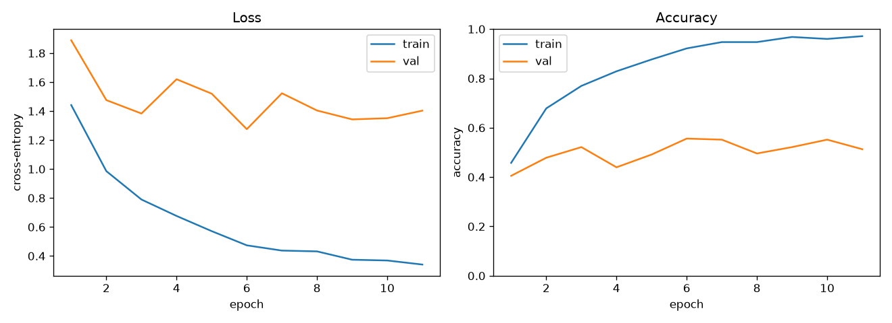
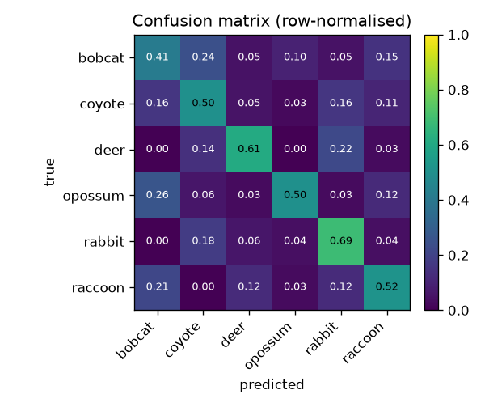
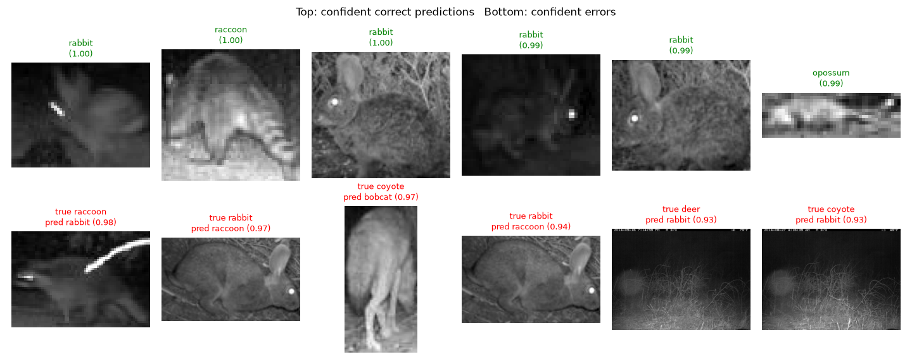

# AI Animal Image Recognition on Night-Vision Camera-Trap Images

**ACM 40960 — Project 9**
Srivani Konda and Navya Sri Mungamuri — University College Dublin, Summer 2026

Camera traps take millions of photos a year, and most of them are empty or taken
at night. The night ones are grayscale infrared images with low contrast, which
are hard for models trained on normal daytime photos. In this project we train a
model to recognise animal species in night-vision (infrared) camera-trap images
and check how well it does using accuracy, precision and recall.

The background reading and the baselines we compare against are in
[`docs/literature_review.md`](docs/literature_review.md).

## The dataset

We use real infrared night-vision camera-trap images from the **Caltech Camera
Traps** dataset (Beery et al., 2018), downloaded through the
[LILA BC](https://lila.science/datasets/caltech-camera-traps) Google Cloud mirror.
A ready-made subset is included in the repo at
[`data/night_wildlife/`](data/night_wildlife):

- 6 species: bobcat, coyote, raccoon, opossum, rabbit, deer
- 200 images per species (1,200 total)
- every image is a genuine night infrared frame (checked to be grayscale)

`scripts/build_night_wildlife.py` builds this subset. It:

- keeps only night captures that are actually grayscale (real infrared),
  single-species, and de-duplicated by capture sequence;
- samples **deterministically** and **stratified across camera locations and
  time** (round-robin over sites, spread across each site's date range) to reduce
  selection bias — the committed build spans 35–75 locations and 18–36 months per
  species;
- stores the frame **uncropped** (only downscaled) and records the animal's
  bounding box in the manifest; the crop to the animal is applied at *load* time
  (`crop_to_bbox`, see `src/data.py`), so nothing is baked into the files;
- reports every rejected/failed download with its id and reason
  (`build_report.txt`) and wipes the output directory first so a re-run can't
  leave stale files.

**Bounding boxes.** ~50% of frames carry a ground-truth box from CCT; a
COCO-pretrained **YOLOv8** detector (`scripts/fill_boxes_yolo.py`) fills in boxes
for frames that lack one, raising coverage to **66%** (598 ground-truth + 200
YOLO). Each row's `box_source` column records `gt` / `yolo` / `none`.

Every image is recorded in
[`data/night_wildlife/manifest.csv`](data/night_wildlife/manifest.csv) with its
source id, original filename, class, camera location, sequence id, timestamp,
month/season, bounding box, `box_source`, split, and SHA-256 checksum.
`python scripts/validate_dataset.py` checks class balance, file integrity,
split/location overlap, and manifest↔file consistency before training.

**Split.** Frames from the same camera share backgrounds, so the split is
**location-held-out**: whole camera sites go to a single split (train / val /
test), and no background is shared between them. This is what makes the reported
accuracy a measure of animal recognition rather than background recognition. See
[`docs/METHODOLOGY.md`](docs/METHODOLOGY.md) for details.

## How to run it

You need Python 3.9+ and the packages in `requirements.txt`.

```bash
pip install -r requirements.txt
```

**1. Train.** ImageNet-pretrained ResNet-18, infrared (grayscale) input,
retraining the later layers on the night images:

```bash
python scripts/run_training.py --data-dir data/night_wildlife --epochs 16 \
    --image-size 224 --pretrained --grayscale --freeze-until layer2 \
    --learning-rate 3e-4 --output-dir results/demo --device cpu
```

(If your machine can't download the pretrained weights automatically, run
`python scripts/fetch_pretrained_weights.py` first.)

**2. Evaluate** on the held-out test set. This prints the scores and saves the
plots:

```bash
python scripts/run_evaluation.py --output-dir results/demo --device cpu
```

**3. Predict** on a single image:

```bash
python scripts/predict.py data/night_wildlife/coyote/coyote_0003.jpg \
    --checkpoint results/demo/best_model.pt
```

```
Predictions for data/night_wildlife/coyote/coyote_0003.jpg:
  1. coyote               0.933
  2. raccoon              0.046
  3. rabbit               0.009
```

Everything (checkpoint, `metrics.json`, and the plots) is written to
`results/demo/`. A saved copy of the plots is in
[`docs/demo_results/`](docs/demo_results/).

## Results

Trained on the 1,200 infrared images above, 16 epochs on CPU. The test set is
small (233 images), so every number is reported with a 95% confidence interval.

**Seen vs. unseen camera locations** (same model, evaluated on both):

| Locations | What it measures | Accuracy (95% CI) |
|-----------|------------------|-------------------|
| **Unseen** (held-out sites) | generalisation to **new cameras** — the honest number | **0.55** (0.49–0.61) |
| Seen (held-out images from training sites) | performance on familiar backgrounds | 0.76 |

The **+0.21** gap between seen and unseen locations is the key result: even with
the animal cropped out of the frame, a model still does noticeably better on
cameras it has seen. Random guessing with 6 classes is 0.17.

Other metrics on the unseen-location test set:

| Metric | Value |
|--------|-------|
| Balanced accuracy | 0.55 |
| Macro-F1 (95% CI) | 0.55 (0.48–0.61) |
| Top-2 / Top-3 accuracy | 0.68 / 0.78 |
| Expected calibration error | 0.14 |

**Detected-animal vs. full-frame** (issue: does cropping to the animal help?),
same location split:

| Input | Box coverage | Unseen acc | ECE |
|-------|-------------|-----------|-----|
| **Detected animal** (crop to box) | 66% (GT + YOLO) | **0.55** | 0.15 |
| Full frame | — | 0.46 | 0.22 |

Cropping to the animal lifts unseen-location accuracy by ~9 points and improves
calibration — evidence the classifier does better when it isn't shown the
background. Adding the YOLO-detected boxes (raising coverage from 50% to 66%) left
accuracy unchanged within the confidence interval (0.55 → 0.545): the imperfect
detector boxes on infrared frames add coverage but little extra signal.

Per-species, unseen-location test (with 95% CI on recall):

| Species  | Precision | Recall | F1   | Recall 95% CI | Test images |
|----------|-----------|--------|------|---------------|-------------|
| rabbit   | 0.62      | 0.69   | 0.65 | 0.55–0.80 | 51 |
| deer     | 0.65      | 0.61   | 0.63 | 0.45–0.75 | 36 |
| opossum  | 0.68      | 0.50   | 0.58 | 0.34–0.66 | 34 |
| raccoon  | 0.50      | 0.52   | 0.51 | 0.35–0.67 | 33 |
| coyote   | 0.42      | 0.50   | 0.46 | 0.35–0.65 | 38 |
| bobcat   | 0.44      | 0.41   | 0.42 | 0.28–0.57 | 41 |





`scripts/run_evaluation.py` writes all of the above to `metrics.json` plus the
confusion matrix and an `error_analysis.png` montage of the most-confident correct
predictions and errors.

## Known limitations

- The 0.55 is from a **small** dataset (200 images/species) with only six species;
  behaviour on rare species and at larger scale is untested.
- Bounding boxes cover 66% of the frames (ground-truth + YOLO); the remaining 34%
  are classified from the whole (letterboxed) frame, so some test images still
  include background.
- The YOLO detector is COCO-pretrained, so its infrared boxes are imperfect;
  fine-tuning a detector on camera-trap boxes could raise coverage and quality.

## Making the dataset bigger

You can pull more images per class, or add more species, straight from the mirror:

```bash
python scripts/build_night_wildlife.py --out data/night_wildlife \
    --per-class 300 --species bobcat coyote raccoon opossum rabbit deer skunk fox
```

## What's in the repo

```
src/        config, data loading, location-grouped split, model, training, evaluation, detection
scripts/    build the dataset, train, evaluate, predict
docs/       literature review, methodology, experiment log, saved result plots
data/       the ready-made infrared dataset + manifest.csv
```

In short: ImageNet-pretrained ResNet-18, infrared grayscale input, later layers
retrained, with class weighting, augmentation, and early stopping. The full
pipeline — data selection, preprocessing, model, training, and evaluation
settings — is documented in [`docs/METHODOLOGY.md`](docs/METHODOLOGY.md).

## Contributors

| Name | Student number | Main responsibility |
|------|----------------|---------------------|
| Srivani Konda (@srivanik8) | 25211398 | Data pipeline — dataset builder, preprocessing, and splits |
| Navya Sri Mungamuri | 25200230 | Model, training, and evaluation |

Both authors contributed to the literature review and the write-up.

## Credit

Caltech Camera Traps — Beery, Van Horn & Perona, *Recognition in Terra Incognita*,
ECCV 2018, via LILA BC (https://lila.science/datasets/caltech-camera-traps).
