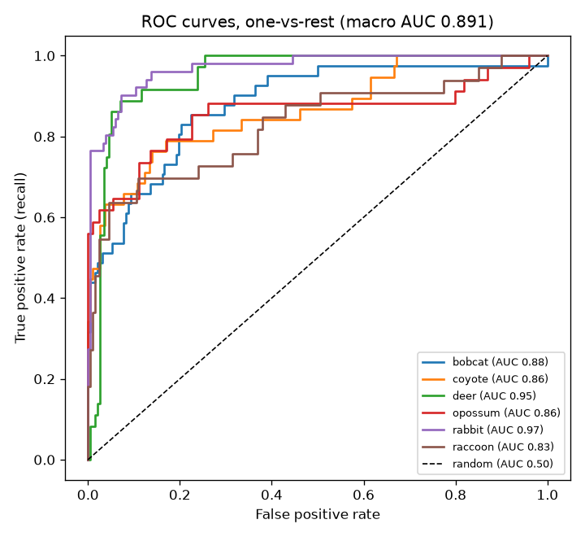

# Night-Vision Wildlife Species Recognition

Identifying animal species in infrared camera-trap photos.

ACM 40960 Project 9, University College Dublin, Summer 2026
Srivani Konda and Navya Sri Mungamuri

Camera traps take millions of photos of wild animals every year. After dark they
switch to an infrared flash, which produces grey, low-contrast images. Models
trained on normal daytime photos tend to do badly on these. We trained a CNN to
recognise six species in night-time infrared frames, and tested it on camera sites
it had never seen during training.

Our best model gets **68.7% accuracy** (95% CI 62.5-74.3) and a macro AUC of
**0.891** on those unseen cameras. With six species, random guessing would be
16.7%.




## Quick start

```bash
conda env create -f environment.yml && conda activate night-wildlife
# or, if you prefer pip:  pip install -r requirements.txt
```

Then train, evaluate and predict:

```bash
python scripts/run_training.py   --data-dir data/night_wildlife --output-dir results/demo --device cpu
python scripts/run_evaluation.py --output-dir results/demo --device cpu
python scripts/predict.py data/night_wildlife/bobcat/bobcat_0032.jpg \
    --checkpoint results/demo/best_model.pt
```

The prediction script prints the top classes and their probabilities:

```
Predictions for data/night_wildlife/bobcat/bobcat_0032.jpg  [input: dataset manifest box, T=1.07]
  1. bobcat               0.843
  2. coyote               0.127
  3. raccoon              0.015
```

Training takes about 15 minutes on a laptop CPU. The dataset is included in the
repo, so nothing else needs downloading.

If you are running inside Codespaces or Docker, data loading stays in one process
by default, because containers usually give you a very small `/dev/shm`. If yours
is large you can speed things up with `--num-workers 2`.

## Results

We tested on 233 images taken at camera locations that were left out of training.
All the averages below are macro averages, so every species counts equally, and we
give 95% confidence intervals because the test set is fairly small.

| Metric | Value |
|--------|-------|
| Accuracy | 0.687 (0.625 - 0.743) |
| Balanced accuracy | 0.680 |
| Precision (macro) | 0.691 |
| Recall (macro) | 0.680 |
| F1 (macro) | 0.682 (0.623 - 0.740) |
| AUC (macro, one-vs-rest) | 0.891 |
| Top-2 accuracy | 0.828 |
| Expected calibration error | 0.048 |

The AUC being much higher than the accuracy tells us something useful. Even when
the model's first guess is wrong, it usually still ranks the correct species near
the top, so the mistakes are not random.

Per species:

| Species | Precision | Recall | F1 | Test images |
|---------|-----------|--------|-----|-------------|
| rabbit | 0.93 | 0.78 | 0.85 | 51 |
| deer | 0.72 | 0.78 | 0.75 | 36 |
| opossum | 0.70 | 0.62 | 0.66 | 34 |
| raccoon | 0.69 | 0.61 | 0.65 | 33 |
| coyote | 0.58 | 0.68 | 0.63 | 38 |
| bobcat | 0.53 | 0.61 | 0.57 | 41 |

Rabbits and deer are the easiest, which makes sense as their body shapes are quite
distinctive. Bobcat and coyote are the hardest, and looking at the confusion matrix
they are mostly getting mixed up with each other. Both are four-legged carnivores
of a similar size, and in a grey infrared image they really do look alike.

### Seen vs unseen cameras

This is the part we think is most interesting. We took the same model and scored it
two ways:

| Camera locations | Accuracy |
|------------------|----------|
| Unseen (not trained on at all) | 0.687 |
| Seen (held-out photos from training cameras) | 0.800 |

There is an 11 point drop when the cameras are new to the model. Photos from one
camera all share the same background, so a model can quietly learn to recognise the
*place* rather than the *animal*. Splitting the data by location, and cropping to
the animal before classifying, is what stops that from inflating our result. If we
had used an ordinary random split we would have reported a better looking number
that did not mean as much.


## How it works

The short version: take the infrared frame, crop to the animal, and feed it to a
ResNet-18 that was pretrained on ImageNet, with the later layers retrained on our
data.

| Stage | What we did |
|-------|-------------|
| Data | 1,200 night infrared photos, 6 species with 200 each, from Caltech Camera Traps |
| Boxes | 86% of photos have an animal box: 598 came with the dataset, 228 we found with MegaDetector, 200 with YOLOv8 |
| Split | By camera location, so a whole site goes to train or val or test, never split across them |
| Preprocessing | Crop to the animal box, pad to a square so nothing is cut off, infrared-specific augmentation |
| Model | ResNet-18 with ImageNet weights, retraining `layer3`, `layer4` and the classifier head |
| Training | AdamW at 3e-4, cosine schedule, class weighting, early stopping, 16 epochs |
| Evaluation | Confusion matrix, ROC and AUC, macro precision/recall/F1, calibration, seen vs unseen |

All the settings and the reasoning behind them are in
[docs/METHODOLOGY.md](docs/METHODOLOGY.md).

We changed one thing at a time and kept a log of what each change was worth:

| Change | Accuracy |
|--------|----------|
| Starting point | 0.55 |
| Padding instead of cropping, plus infrared augmentation | 0.61 |
| Better animal boxes from MegaDetector | 0.69 |

Two things we tried did not help, and we left them in the log rather than quietly
dropping them. Test-time augmentation came out slightly worse, and temperature
scaling improved how well-calibrated the probabilities are without changing the
accuracy at all.

## What is in the repo

```
src/        config, data loading, location split, model, training, evaluation, detection
scripts/    build the dataset, validate it, train, evaluate, predict
docs/       methodology, literature review, experiment log, saved results
data/       the infrared dataset and manifest.csv
tests/      39 tests, run them with pytest
```

- [docs/METHODOLOGY.md](docs/METHODOLOGY.md) for the full pipeline
- [docs/literature_review.md](docs/literature_review.md) for background reading
- [docs/experiments.md](docs/experiments.md) for every run we did
- [docs/DATA_LICENSE.md](docs/DATA_LICENSE.md) for data licensing and attribution

Every run is seeded and saves its `config.json`, `environment.json` and a
per-epoch `history.csv` next to the checkpoint, so results can be reproduced.
Running `python scripts/validate_dataset.py` checks the dataset before training.

## Limitations

- Only 6 species and 1,200 photos. The 68.7% applies to these unseen Caltech
  Camera Traps sites, and we are not claiming it would hold for other regions or
  other species.
- 14% of the photos have no animal box, so those get classified from the whole
  frame with the background still in it.
- One model and one seed. We did not cross-validate across several different
  location splits, which would give a better idea of the uncertainty.

## Contributors

| Name | Student number | Main responsibility |
|------|----------------|---------------------|
| Srivani Konda ([@srivanik8](https://github.com/srivanik8)) | 25211398 | Data pipeline: dataset builder, preprocessing, splits |
| Navya Sri Mungamuri | 25200230 | Model, training, evaluation, results |

## Licence and credit

Our code is MIT licensed, see [LICENSE](LICENSE).

The photos come from the Caltech Camera Traps dataset (Beery, Van Horn and Perona,
*Recognition in Terra Incognita*, ECCV 2018), obtained through
[LILA BC](https://lila.science/datasets/caltech-camera-traps) under the
CDLA-Permissive licence. Details of what we redistribute are in
[docs/DATA_LICENSE.md](docs/DATA_LICENSE.md).
